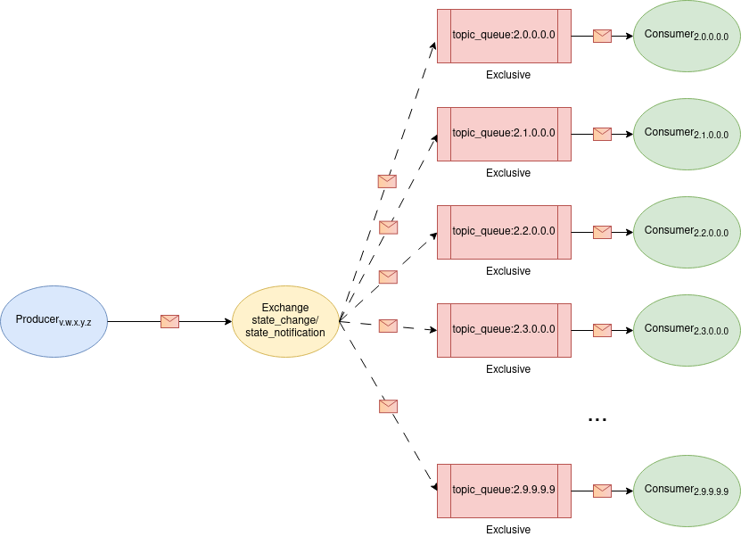

# Introduction

This script create tree hierarchy of nodes where each node is running as separate process which is accessible via REST 
API or using RabbitMQ middleware based on selected `architecture` attribute in `configuration.yaml`.

## REST API

### GET /statemachine/state
- return current state of the node as one of the following:
  - `"State": "State.Initialization"`
  - `"State": "State.Stopped"`
  - `"State": "State.Starting"`
  - `"State": "State.Running"`
  - `"State": "State.Error"`
- synchronous operation
### POST /statemachine/input
- change state of the node
  - from stopped to starting and then running
  - from running immediately to stopped
- 3 parameters:
  - `start`
    - decimal number between 0 and 1
    - probability of failure
  - `stop`
    - any nonempty string
  - `debug`
    - boolean: True/False 
    - debug prints containing timestamps when changing state
- asynchronous operation using asyncio
  - start=x
    1. immediately change state from State.Stopped to State.Starting
    2. `await` sleep 10 s
    3. propagate this request to all its children if any by creating tasks
    4. `await` for all task
    5. set own state based on x probability and children states
  - stop=y
    1. propagate immediately this request to all its children if any
    2. stop itself
### POST /notifications
- update parent about current state
- automatically triggered in case of changing state
- it is propagated from origin to root node 
  - update each node on the way
- parameters:
  - `state`
    - current state of the sender
    - filled automatically
  - `sender`
    - full URL of the sender
    - filled automatically
- asynchronous operation using asyncio
  - `await` posting notification to its parent if not root

## REST Client
This script contains manually created client however it is possible to generate client automatically using Python pacakge for following languages:
  - C++
  - C#
  - Java
  - PHP
  - Python
  - Ruby
  - Scala

Note: Web generator support even wider range of languages. Current support of language might change during the time.   

### Autogenerate python client 

#### Python package
```sh
pipenv install
pipenv run openapi-python-client generate --url http://127.0.0.1:20000/openapi.json
```
NOTE: You might have to change IP and port ich you have changed `configuration.yaml` file!

#### Web generator 
Use following link: https://editor.swagger.io/ where you just upload http://127.0.0.1:20000/openapi.json (much straightforward usage than offline generator because of good `README.md` containing personalised example).

After execution of commands above, you should be able to see a new directory with generated client library.
ss
## RabbitMQ - RPC & Topic



### Producer
Element responsible for emitting messages to the broker. Producer sends the message to the exchange base on type of the message. There are two separate exchanges one for changing the state the other one for notification. Exchange handles routing base on routing_key/binding_key which is equivalent of port number in REST architecture. The only difference is that digits are separated with `.`, so it is possible use `#` any (single) digit or `*` any sequence of digits for easier broadcast. Once message arrive to the consumer queue, consumer will be triggered. This principle is used to propagate messages from top down (change state) or bottom up (notification).

Note: 
- Special routing character are currently not utilized.
- Producer binding_key is not important because it's only on way communication

The implementation can be found in `send.py` and it implements:

#### Change state
- propagate new state to children or update own state if it's leave node

#### Notification
- update parent node about current node state

### Consumer
Element responsible for processing messages from the broker. The implementation can be found in `receive.py` and it implements:

#### Listener
- listener which is triggered when new message arrive and running in infinite asynchronous loop

#### Initialization
- actions which take immediately after node is ready to consume data 

#### Shutdown
- actions need to be done before proper shutdown

### Queues
Each node has own queue for receiving messages (red or orange envelope) named topic_queue:binding_key (e.g. rpc_queue:2.0.0.0.0). All these ques are Auto-delete -> they will be deleted when the last consumer unsubscribe.


### Queues

#### RPC queues
Each node has own queue for receiving RPC requests (white envelope) named rpc_queue:binding_key (e.g. rpc_queue:2.0.0.0.0). All these ques are Auto-delete -> they will be deleted when the last consumer unsubscribe.

#### Client Queue
Client has one uniquely named queue generated just for one purpose - receive return value (blue envelope) from RPC server. This queue is Exclusive -> it will be deleted when the connection is closed.

### RPC Server
Element responsible for replaying to messages from the broker. Runs infinite asynchronous loop to process any incoming request to get current state which is blocking operation. Once the method execution is finished it returns state encoded into binary form to queue defined in the request properties. 
The implementation can be found in `model.py` implemented in `run_get_server` method.

#### get_state()
- implemented as blocking waiting

### RPC Client
Element responsible for processing messages from the broker. The implementation can be found in `consumer.py` and it implements rpc call:
1. send request to get node current state without waiting for the response
2. when response arrive to the queue it is processed

### Internal communication:

There are two (`model.Node.run_get_server()` and `receive.run()`) subprocesses running in infinite asynchronous loop. 

#### RPC Client-Server

Client sends request (white envelope) to the selected server and server responds with json reply containing current state (blue envelope).

Envelope formats:

White:
```json
{
    "action": "get_state"
}
```

Blue:
```json
{
    "state": "Starting"
}
```

#### One way communication

Initiator uses send_message method to send message in json format. Receiver receive it and base on content inside it process it with notify or change_state method.

Envelope formats:

Red:
```json
{
    "type": "Notification",
    "sender": "2.0.0.0.0",
    "toState": "Running"
}
```

Orange:
```json
{
    "type": "Input",
    "name": "Start",
    "parameters": {
        "chance_to_fail": 0.02
    }
}
```


# Prerequisite

Pipenv - https://pypi.org/project/pipenv/
RabbitMQ - https://www.rabbitmq.com/

# Run

```sh
pipenv install
pipenv run python service.py --port 20000 --levels 2 --children 3
```

# Configuration

There is `configuration.yaml` file containing all variables that are possible to change. Range of some values is limited -> see individual comments.

# Manual test

Note: There are no automated tests!

## REST

Open `<IP>:<port>/docs#/` to manually try endpoints on the current node.

e.g. http://127.0.0.1:20000/docs#/


## RabbitMQ

Convert port number to routing key by putting dot between any two digits and call `consumer.py` with this argument

```sh
pipenv install
pipenv run python rpc_client.py 2.3.1.0.0
```


# Description

After running there will be created tree hierarchy of nodes where each of them exposes either REST API or RabbitMQ described above. Originally all nodes are in `State.Stopped` after initialization what can be verified by `GET` request to `/statemachine/state` endpoint. It's possible to sent `POST` request to `/statemachine/input endpoint` in order to change the state. There are two possible parameters `start` and `stop`. `start` parameter define probability of going into `State.Error` and it must be in range [0,1]. Node change state to `State.Starting` immediately after submitting the request and remains in that state until all it children change state as well. There are 2 possible scenarios: either all children nodes and also current node successfully transitioned into `State.Running` or at least one node (doesn't matter weather current or child) transitioned into `State.Error` - then current node's state is `State.Error`. Running node can transition into `State.Error` with probability defined in the start parameter and this process is periodically repeated with period defined in the `configuration.yaml` file. 

`/notofications` endpoint is called automatically when node changes its state from `State.Running` to `State.Error` or `State.Stopped`. This way parent can be immediately updated about the change of children and also update its state as well and propagate this information to its parent until the root node is informed. 

## State Diagram


### Legend:
- x = chance to fail - entered parameter while sending POST request to the endpoint
- w = node.time.starting from `configuration.yaml`
- y = randomly generated value from range (0,1)
- z = node.time.running from `configuration.yaml`

# Shutdown

Sending signal SIGTERM `kill -15 <PID>` will be propagated from node to all its children. Node waits for termination of its children and terminate itself after all children are terminated or after 20s (the value can be changed in `configuration.yaml`) since SIGTERM signal arrived (what is earlier). 

## REST

Termination of the process is internally handled by FastAPI.

## RabbitMQ

For Consumer and RPC server:

1. Terminate Consumer:
   - Note: `connection.add_callback_threadsafe(_stop)` is necessary to use since it is called from another thread
   1. Stop consuming
   2. Channel close
   3. Connection close
2. Cancel a running consumer task:
   - raise an `asyncio.CancelledError` exception
3. Stop infinite asynchronous loop
   - Note: there is just one shared loop -> no need to stop it twice

# Reliability

## REST

- Error code in case of unprocessed request

## RabbitMQ


- uses TCP

### Acknowledgements

- from consumers to RabbitMQ
- defined in `channel.basic_consume(... , auto_ack=False)` 
Note: Manual ack from consumer is required but there is no guarantee between broker and publisher by default

#### Automatic

- `auto_ack=True` - automatic acknowledgement mode -> message is considered to be successfully delivered immediately after it is sent
    - higher throughput 
    - reduced safety of delivery and consumer processing
      - if consumer's TCP connection or channel is closed before successful delivery, the message sent by the server will be lost
    - consumer overload 
    - Note: Automatic acknowledgement mode is therefore only recommended for consumers that can process deliveries efficiently and at a steady rate


#### Manual

- `auto_ack=False` is the default value which require manual ack from consumer
  - bounded channel prefetch which limits the num+ber of outstanding ("in progress") deliveries on a channel
  - `channel.basic_ack(tag, multiple)` - (multiple) positive acknowledgements
  - `channel.basic_nack(tag, multiple, requeue)` - (multiple) negative acknowledgements
  - `channel.basic_reject(tag, requeue)` - (single) negative acknowledgements

  ##### Arguments:

    - `tag` - unique id within the channel
    - `multiple=True` - boolean value whether ack/nack all message up to the current one
    - `requeue=False` - boolean value whether to resent nack/rejected message
      - message will be routed to a Dead Letter Exchange if it is configured, otherwise it will be discarded


### Publisher confirms

- broker acknowledgements to publishers
- the only way to guarantee that a message isn't lost is by using transactions
- decrease throughput by a factor of 250
- `channel.confirm_delivery()` - enabled delivery confirmations
  - raise `pika.exceptions.UnroutableError` in case of nack while publishing the message `channel.basic_publish(exchange=exchange_name, routing_key=routing_key, body=message)`
- the broker may also set the multiple field in `Basic.Ack` to indicate that all messages up to and including the one with the sequence number have been handled

Note: `channel.confirm_delivery(ack_nack_callback=on_delivery_confirmation)` possible with SelectConnection `connection = pika.SelectConnection(...)` - asynchronous publisher not suitable for this use-case

#### Confirmation  
- for un-routable messages, the broker will issue a confirmation once the exchange verifies a message won't route to any queue
- for routable messages, the `Basic.Ack` is sent when a message has been accepted by all the queues (it means persisting to disk in case of persistent)

# Management

## Activate plugin

```shell
sudo service rabbitmq-server restart
```

## Access web UI

[web UI](http://localhost:15672/#/)

Administrator credentials:
  username: guest
  password: guest

Note: it is possible to add more users with different permissions (management, policymaker, monitoring, administrator) `www.rabbitmq.com/management.html#permissions`

## CLI interface

```shell
python rabbitmqadmin --help
```

[CLI documentation](https://www.rabbitmq.com/management-cli.html)