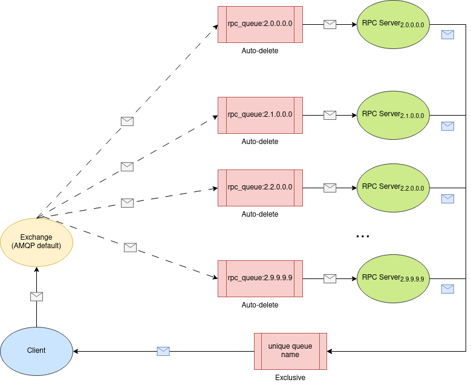
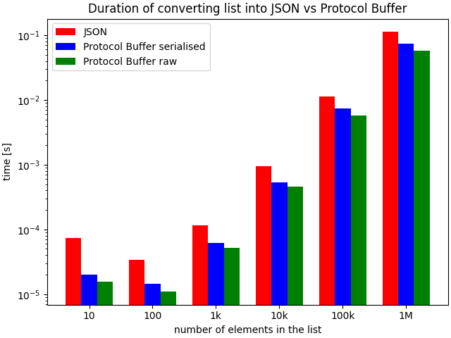
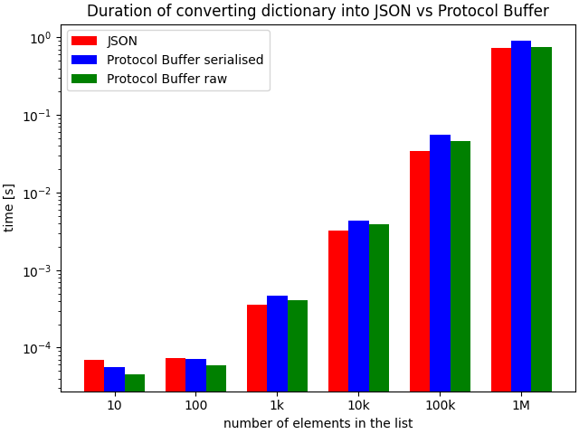
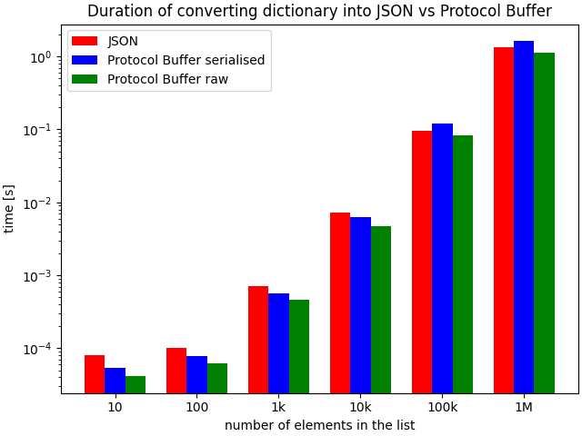

# Introduction

This script create tree hierarchy of nodes where each node is running as separate process which is accessible via REST
API or using RabbitMQ middleware based on selected `architecture` attribute in `configuration.yaml`.

## Node

- All nodes have 5 digit long ID for uniq identification during the communication
    - all nodes run identical code, the only difference is the ID which define node's position in the tree
- Root node has ID 20 000(REST)/2.0.0.0.0(MOM) by default
- The first most left child keep copy ID from parent and change first (from the left) 0 -> 1
    - The seconds most left child keep copy ID from parent and change first (from the left) 0 -> 2, etc. up to X
      which is number of children
    - maximum allowed number of children is 9 because of decimal number limitation
- This proces recursively continue until selected level is reached
    - level of the image as example is 2 (0 level = root)
    - maximum allowed level is 4 because of ID length limitation

## REST API

### Nodes tree structure


### GET /statemachine/state

- return current state of the node as one of the following:
    - `"State": "State.Initialization"`
    - `"State": "State.Stopped"`
    - `"State": "State.Starting"`
    - `"State": "State.Running"`
    - `"State": "State.Error"`
- synchronous operation

### POST /statemachine/input

- change state of the node
    - from stopped to starting and then running
    - from running immediately to stopped
- 3 parameters:
    - `start`
        - decimal number between 0 and 1
        - probability of failure
    - `stop`
        - any nonempty string
    - `debug`
        - boolean: True/False
        - debug prints containing timestamps when changing state
- asynchronous operation using asyncio
    - start=x
        1. immediately change state from State.Stopped to State.Starting
        2. `await` sleep 10 s
        3. propagate this request to all its children if any by creating tasks
        4. `await` for all task
        5. set own state based on x probability and children states
    - stop=y
        1. propagate immediately this request to all its children if any
        2. stop itself

### POST /notifications

- update parent about current state
- automatically triggered in case of changing state
- it is propagated from origin to root node
    - update each node on the way
- parameters:
    - `state`
        - current state of the sender
        - filled automatically
    - `sender`
        - full URL of the sender
        - filled automatically
- asynchronous operation using asyncio
    - `await` posting notification to its parent if not root

### Pydantic Validation

All messages sent from any node is validated by pydantic. The BaseModel of `StateChange` and `Notification` with
validation is defined in `messages.py`. Any invalid value will raise `ValidationError` exception which will be
caught `catch_exceptions_middleware()` provided by FastAPI.

|                                                                              |
|:--------------------------------------------------------------------------------------------------------------------------:|
| Instantiation Performance      [source](https://janhendrikewers.uk/pydantic_vs_protobuf_vs_namedtuple_vs_dataclasses.html) |

Note: Pydantic validation is considered to be slow and therefore there is option to turn it off in `configuration.yaml`

#### Change State

Allow only one of the following command:

- `{ 'start': <probability> }` - \<probability> must be in range [0 - 1]
- `{ 'stop': '_' }` - '_' is the only allowed value

#### Notification

Allow only following format of the message:

- `{ 'state': <State>, 'sender': 'A.B.C.D.E'}` - \<State> must be in only one of {Initialisation, Starting, Stopped,
  Running, Error},  [A - E] is single digit

## REST Client

This script contains manually created client however it is possible to generate client automatically using Python
pacakge for following languages:

- C++
- C#
- Java
- PHP
- Python
- Ruby
- Scala

Note: Web generator support even wider range of languages. Current support of language might change during the time.

### Autogenerate python client

#### Python package

```sh
pipenv install
pipenv run openapi-python-client generate --url http://127.0.0.1:20000/openapi.json
```

NOTE: You might have to change IP and port ich you have changed `configuration.yaml` file!

#### Web generator

Use following link: https://editor.swagger.io/ where you just upload http://127.0.0.1:20000/openapi.json (much
straightforward usage than offline generator because of good `README.md` containing personalised example).

After execution of commands above, you should be able to see a new directory with generated client library.
ss

## RabbitMQ - RPC & Topic

### Nodes tree structure


\

|            |
|:-------------------------------------------------------:|
| Message propagation using Topic - one way communication |

### Producer

Element responsible for emitting messages to the broker. Producer sends the message to the exchange base on type of the
message. There are two separate exchanges one for changing the state the other one for notification. Exchange handles
routing base on routing_key/binding_key which is equivalent of port number in REST architecture. The only difference is
that digits are separated with `.`, so it is possible use `#` any (single) digit or `*` any sequence of digits for
easier broadcast. Once message arrive to the consumer queue, consumer will be triggered. This principle is used to
propagate messages from top down (change state) or bottom up (notification).

Note:

- Special routing character are currently not utilized.
- Producer binding_key is not important because it's only on way communication

The implementation can be found in `send.py` and it implements:

#### Change state

- propagate new state to children or update own state if it's leave node

#### Notification

- update parent node about current node state

### Consumer

Element responsible for processing messages from the broker. The implementation can be found in `receive.py` and it
implements:

#### Listener

- listener which is triggered when new message arrive and running in infinite asynchronous loop

#### Initialization

- actions which take immediately after node is ready to consume data

#### Shutdown

- actions need to be done before proper shutdown

### Queues

Each node has own queue for receiving messages (red or orange envelope) named topic_queue:binding_key (e.g. rpc_queue:
2.0.0.0.0). All these ques are Auto-delete -> they will be deleted when the last consumer unsubscribe.

|                     |
|:------------------------------------------------------------:|
| Message propagation using RPC Server - two way communication |

### Queues

#### RPC queues

Each node has own queue for receiving RPC requests (white envelope) named rpc_queue:binding_key (e.g. rpc_queue:
2.0.0.0.0). All these ques are Auto-delete -> they will be deleted when the last consumer unsubscribe.

#### Client Queue

Client has one uniquely named queue generated just for one purpose - receive return value (blue envelope) from RPC
server. This queue is Exclusive -> it will be deleted when the connection is closed.

### RPC Server

Element responsible for replaying to messages from the broker. Runs infinite asynchronous loop to process any incoming
request to get current state which is blocking operation. Once the method execution is finished it returns state encoded
into binary form to queue defined in the request properties.
The implementation can be found in `model.py` implemented in `run_get_server` method.

#### get_state()

- implemented as blocking waiting

### RPC Client

Element responsible for processing messages from the broker. The implementation can be found in `consumer.py` and it
implements rpc call:

1. send request to get node current state without waiting for the response
2. when response arrive to the queue it is processed

### Internal communication:

There are two (`model.Node.run_get_server()` and `receive.run()`) subprocesses running in infinite asynchronous loop.

Note: Inter-node communication consists of 4 (white, blue, orange, red) different envelopes where all of them support
either JSON or Protocol Buffer for data serialisation and deserialization. To change the envelopes' format
update `configuration.yaml` file accordingly.

#### RPC Client-Server

Client sends request (white envelope) to the selected server and server responds with json reply containing current
state (blue envelope).

Envelope formats:

White:

```json
{
  "action": "get_state"
}
```

Blue:

```json
{
  "state": "Starting"
}
```

#### One way communication

Initiator uses send_message method to send message in json format. Receiver receive it and base on content inside it
process it with notify or change_state method.

Envelope formats:

Red:

```json
{
  "type": "Notification",
  "sender": "2.0.0.0.0",
  "toState": "Running"
}
```

Orange:

```json
{
  "type": "Input",
  "name": "Start",
  "parameters": {
    "chance_to_fail": 0.02
  }
}
```

#### Validation

There is implemented custom validator for all envelopes since documentation suggest that approach: "You should consider
writing application-specific custom validation routines for your buffers" but there exist also some 3rd part libraries:

Note: To disable RabbitMQ envelopes validation update `configuration.yaml` file.

- [protoc-gen-validate](https://github.com/bufbuild/protoc-gen-validate) - only proto3 supported


# Prerequisite

Pipenv - https://pypi.org/project/pipenv/
RabbitMQ - https://www.rabbitmq.com/

# Run

```sh
pipenv install
pipenv run python service.py --port 20000 --levels 2 --children 3
```

# Configuration

There is `configuration.yaml` file containing all variables that are possible to change. Range of some values is
limited -> see individual comments.

# Tests

- run tests and store the report in `report.xml` file
- tests are automatically executed after each push in gitlab-ci pipeline

```sh
python -m pytest --junitxml=report.xml
```

## REST tests

### GET state request values

- values
- all node

### GET state request

- time duration

### Single node test

- testing whole life cycle
    1. Initializing
    2. Stopped
    3. Running
    4. Stopped
    5. Starting
    6. Error

### Complex test with middle node causing error

- propagation to children (POST change state)
- propagation to the parent (POST notification)
- siblings and their children are not affected

## MOM tests

### RPC reply value

- request state from RPC server and compare values

### RPC reply duration

- request state from RPC server and measure duration

### Notification with parent

- node in running state receives error notification from children -> change own state

### Notification arrive to node in Error state

- node in error state receives running notification from children -> ignor

### Notification from the only child

- node has one child and receive notification from it -> immediately change the state

### Notification from two children

- node has more children but receive notification just from one of them -> Initializing
- node has more children but receive notification just from both of them -> Change the state accordingly:
    - starting + stopped = stopped
    - starting + running = starting
    - running + running = running
    - running + error = error

### Changing the state of node without children (Stopped and Running)

- post change state message to the node that has no children -> immediately change the state:
    - stopped -> starting -> running
    - not immediately

### Changing the state of node in Error state

- post change state message to the node that is in error state -> ignored

### Changing the state of node without children (Running -> Stopped)

- post change state (stopped) message to the node that is in running state -> state changed to stopped immediately

### Changing the state of node with two children

- check propagation of change state message when node has children
    - parent stays in starting until both children are not running

## REST manual testing

Open `<IP>:<port>/docs#/` to manually try endpoints on the current node.

e.g. http://127.0.0.1:20000/docs#/


Note: In case of missing or invalid parameter response code will be 400 however in case that subset of parameters
contains valid combination (key: value) it will be correctly processed with response code 200. See `examples.py` for
better understanding

## RabbitMQ manual testing

Convert port number to routing key by putting dot between any two digits and call `consumer.py` with this argument

Note: In case of incorrect orange envelope (change state) format or content debug
print `Wrong operation! Node remains in : <original_state>` and in case of invalid red envelope (
notification) `Invalid notification! Node remains in : <original_state>`. To try it see `examples.py`

```sh
pipenv install
pipenv run python rpc_client.py 2.3.1.0.0
```

# Description

After running there will be created tree hierarchy of nodes where each of them exposes either REST API or RabbitMQ
described above. Originally all nodes are in `State.Stopped` after initialization what can be verified by `GET` request
to `/statemachine/state` endpoint. It's possible to sent `POST` request to `/statemachine/input endpoint` in order to
change the state. There are two possible parameters `start` and `stop`. `start` parameter define probability of going
into `State.Error` and it must be in range [0,1]. Node change state to `State.Starting` immediately after submitting the
request and remains in that state until all it children change state as well. There are 2 possible scenarios: either all
children nodes and also current node successfully transitioned into `State.Running` or at least one node (doesn't matter
weather current or child) transitioned into `State.Error` - then current node's state is `State.Error`. Running node can
transition into `State.Error` with probability defined in the start parameter and this process is periodically repeated
with period defined in the `configuration.yaml` file.

`/notofications` endpoint is called automatically when node changes its state from `State.Running` to `State.Error`
or `State.Stopped`. This way parent can be immediately updated about the change of children and also update its state as
well and propagate this information to its parent until the root node is informed.

## State Diagram


### Legend:

- x = chance to fail - entered parameter while sending POST request to the endpoint
- w = node.time.starting from `configuration.yaml`
- y = randomly generated value from range (0,1)
- z = node.time.running from `configuration.yaml`

# Shutdown

Sending signal SIGTERM `kill -15 <PID>` will be propagated from node to all its children. Node waits for termination of
its children and terminate itself after all children are terminated or after 20s (the value can be changed
in `configuration.yaml`) since SIGTERM signal arrived (what is earlier).

## REST

Termination of the process is internally handled by FastAPI.

## RabbitMQ

For Consumer and RPC server:

1. Terminate Consumer:
    - Note: `connection.add_callback_threadsafe(_stop)` is necessary to use since it is called from another thread

    1. Stop consuming
    2. Channel close
    3. Connection close
2. Cancel a running consumer task:
    - raise an `asyncio.CancelledError` exception
3. Stop infinite asynchronous loop
    - Note: there is just one shared loop -> no need to stop it twice

# Reliability

## REST

- Error code in case of unprocessed request

## RabbitMQ


- uses TCP

### Acknowledgements

- from consumers to RabbitMQ
- defined in `channel.basic_consume(... , auto_ack=False)`
  Note: Manual ack from consumer is required but there is no guarantee between broker and publisher by default

#### Automatic

- `auto_ack=True` - automatic acknowledgement mode -> message is considered to be successfully delivered immediately
  after it is sent
    - higher throughput
    - reduced safety of delivery and consumer processing
        - if consumer's TCP connection or channel is closed before successful delivery, the message sent by the server
          will be lost
    - consumer overload
    - Note: Automatic acknowledgement mode is therefore only recommended for consumers that can process deliveries
      efficiently and at a steady rate

#### Manual

- `auto_ack=False` is the default value which require manual ack from consumer
    - bounded channel prefetch which limits the num+ber of outstanding ("in progress") deliveries on a channel
    - `channel.basic_ack(tag, multiple)` - (multiple) positive acknowledgements
    - `channel.basic_nack(tag, multiple, requeue)` - (multiple) negative acknowledgements
    - `channel.basic_reject(tag, requeue)` - (single) negative acknowledgements

  ##### Arguments:

    - `tag` - unique id within the channel
    - `multiple=True` - boolean value whether ack/nack all message up to the current one
    - `requeue=False` - boolean value whether to resent nack/rejected message
        - message will be routed to a Dead Letter Exchange if it is configured, otherwise it will be discarded

### Publisher confirms

- broker acknowledgements to publishers
- the only way to guarantee that a message isn't lost is by using transactions
- decrease throughput by a factor of 250
- `channel.confirm_delivery()` - enabled delivery confirmations
    - raise `pika.exceptions.UnroutableError` in case of nack while publishing the
      message `channel.basic_publish(exchange=exchange_name, routing_key=routing_key, body=message)`
- the broker may also set the multiple field in `Basic.Ack` to indicate that all messages up to and including the one
  with the sequence number have been handled

Note: `channel.confirm_delivery(ack_nack_callback=on_delivery_confirmation)` possible with
SelectConnection `connection = pika.SelectConnection(...)` - asynchronous publisher not suitable for this use-case

#### Confirmation

- for un-routable messages, the broker will issue a confirmation once the exchange verifies a message won't route to any
  queue
- for routable messages, the `Basic.Ack` is sent when a message has been accepted by all the queues (it means persisting
  to disk in case of persistent)

### Durability

It is possible to set queues so that messages will survive broker reboot by `channel.queue_declare(... , durable=True)`

# Management o RabbitMQ

## Activate plugin

```shell
sudo rabbitmq-plugins enable rabbitmq_management
sudo service rabbitmq-server restart
```

## Access web UI

[web UI](http://localhost:15672/#/)

Administrator credentials:
username: guest
password: guest

Note: it is possible to add more users with different permissions (management, policymaker, monitoring,
administrator) `www.rabbitmq.com/management.html#permissions`

## CLI interface

```shell
python rabbitmqadmin --help
```

[CLI documentation](https://www.rabbitmq.com/management-cli.html)

# Logging of RabbiMQ

- enabled by default
    - log file stored in `var/log/rabbitmq`
        - possible to have one log file per category -> `log.<category>.file` where category can be one of the:
            - connection
            - channel
            - queue
            - mirroring
            - federation
            - upgrade
            - default
        - possible to have a different log level for each message category -> `log.<category>.level` where value can be
          one of the:
            - debug
            - info
            - warning
            - error
            - critical
            - none
    - other possibilities:
        - log to the console -> `log.console = true`
        - log to the syslog -> `log.syslog = true`
- create file `rabbitmq.conf` in `/etc/rabbitmq` dir
- adjust configuration base on your needs:

```text
## Logging settings.
##
## See https://rabbitmq.com/logging.html for details.
##

## Log directory, taken from the RABBITMQ_LOG_BASE env variable by default.
##
# log.dir = /var/log/rabbitmq

## Logging to file. Can be false or a filename.
## Default:
# log.file = rabbit.log

## To disable logging to a file
# log.file = false

## Log level for file logging
##
# log.file.level = info

## File rotation config. No rotation by default.
## DO NOT SET rotation date to ''. Leave the value unset if "" is the desired value
# log.file.rotation.date = $D0
# log.file.rotation.size = 0

## Logging to console (can be true or false)
##
# log.console = false

## Log level (debug/info/warning/error/critical/none) for console logging
##
# log.console.level = info

## Logging to the amq.rabbitmq.log exchange (can be true or false)
##
# log.exchange = false

## Log level to use when logging to the amq.rabbitmq.log exchange
##
# log.exchange.level = info
```

Note: Do not forget to add execute permission to all directories on the path and add write permission the log file

## Logging messages using firehose

- turned off by default
  ```shell 
    sudo rabbitmqctl trace_off
  ```
- turned on -> performance will drop somewhat due to additional messages being generated and routed
  ```shell 
    sudo rabbitmqctl trace_on 
  ```
- add plugin to see message in Management UI
  ```shell 
    sudo rabbitmq-plugins enable rabbitmq_tracing
  ```
- remove plugin to reduce broker overload
  ```shell 
    sudo rabbitmq-plugins disable rabbitmq_tracing
  ```
- update `enabled_plugins` file if necessary (not necessary by default)

```text
....
{rabbitmq_tracing,
   [
       {directory, "/var/tmp/rabbitmq-tracing"},
       {username, "guest"},
       {password, "guest"}
   ]
},
....
```

- open [web GUI](http://localhost:15672/#/traces)
    - add a new trace
    - see `trace.log` file where you can find all filtered messages based on selected pattern
        - default credentials: "guest"

## Variable configuration

- create `rabbitmq-env.conf` file in `/etc/rabbitmq` directory
    - [environment variables used by RabbitMQ](https://www.rabbitmq.com/configure.html#supported-environment-variables)
        - example:
      ```text
      NODENAME=rabbit@rcms-ss23
      ```
    - Note: variables from file are used only if there are no or empty environment variables with the same name and
      prefix `RABBITMQ_`

# Run RabbitMQ

## Run on localhost

### Start in the background

```shell
sudo rabbitmq-server -detached
```

### Stop

```shell
sudo rabbitmqctl stop
```

### Restart

```shell
sudo service rabbitmq-server restart
```

## Run in Docker

```shell
sudo systemctl start docker
sudo docker run -it --rm --name rabbitmq -p 5672:5672 -p 15672:15672 rabbitmq:3.12-management
```

# Measurements

## JSON

1. Dump data to JSON:
    ```text
    import json

    data = ...
    json_data = json.dumps(data)
    ```

## Protocol Buffer

1. Create `<name>.proto` file: e.g.

    ```text
    syntax = "proto2";

    package tutorial;

    message Person {
        optional string name = 1;
        optional int32 id = 2;
        optional string email = 3;

    enum PhoneType {
        PHONE_TYPE_UNSPECIFIED = 0;
        PHONE_TYPE_MOBILE = 1;
        PHONE_TYPE_HOME = 2;
        PHONE_TYPE_WORK = 3;
    }

    message PhoneNumber {
        optional string number = 1;
        optional PhoneType type = 2 [default = HOME];
    }

    repeated PhoneNumber phones = 4;
    }

    message AddressBook {
        repeated Person people = 1;
    }
    ```

   Note: do not use `required` mainly because of compatibility issues

2. Compile it `./protoc-23.4-linux-x86_64/bin/protoc -I=$SRC_DIR --python_out=$DST_DIR $SRC_DIR/<name>.proto`
3. Assign values: e.g.
    ```text
    import <name>_pb2
    person = <name>_pb2.Person()
    person.id = 1234
    person.name = "John Doe"
    person.email = "jdoe@example.com"
    phone = person.phones.add()
    phone.number = "555-4321"
    phone.type = <name>_pb2.Person.HOME
   ```

## JSON vs Protocol Buffer

### Envelopes


| Envelope |  JSON   | ProtocolBuffer | Reduction |
|:---------|:-------:|:--------------:|----------:|
| White    |  90 B   |      53 B      |      41 % |
| Blue     | 93.2 B  |     57.2 B     |      39 % |
| Red      | 141.2 B |     81.2 B     |      42 % |
| Orange   | 155.2 B |     73.2 B     |      53 % |
| Average  | 119.9 B |    66.15 B     |      45 % |

### Python list

#### Size


| List length |    JSON     | ProtocolBuffer Serialised | ProtocolBuffer raw object | Reduction |
|:------------|:-----------:|:-------------------------:|:-------------------------:|----------:|
| 10          |    143 B    |           107 B           |           74 B            |   25-48 % |
| 100         |   1 029 B   |           813 B           |           780 B           |   21-24 % |
| 1k          |   9 849 B   |          7 833 B          |          7 800 B          |   20-21 % |
| 10k         |  98 049 B   |         78 033 B          |         78 000 B          |      20 % |
| 100k        |  980 049 B  |         780 033 B         |         780 000 B         |      20 % |
| 1M          | 9 800 049 B |        7 800 033 B        |        7 800 000 B        |      20 % |

#### Time duration



| List length |    JSON    | ProtocolBuffer Serialised | ProtocolBuffer raw object | Reduction |
|:------------|:----------:|:-------------------------:|:-------------------------:|----------:|
| 10          | 0.000 07 s |        0.000 02 s         |        0.000 02 s         |      71 % |
| 100         | 0.000 03 s |        0.000 01 s         |        0.000 01 s         |      66 % |
| 1k          | 0.000 11 s |        0.000 06 s         |        0.000 05 s         |   45-55 % |
| 10k         | 0.001 09 s |        0.000 53 s         |        0.000 45 s         |   51-59 % |
| 100k        | 0.011 31 s |        0.007 35 s         |        0.005 78 s         |   35-49 % |
| 1M          | 0.113 41 s |        0.074 11 s         |        0.057 23 s         |   35-50 % |

### Python dictionary (short keys < 7 characters)

#### Size


| Dictionary length |     JSON     | ProtocolBuffer Serialised | ProtocolBuffer raw object | Reduction |
|:------------------|:------------:|:-------------------------:|:-------------------------:|----------:|
| 10                |    193 B     |           157 B           |           124 B           |   19-36 % |
| 100               |   1 619 B    |          1 403 B          |          1 370 B          |   13-15 % |
| 1k                |   16 739 B   |         14 723 B          |         14 690 B          |      12 % |
| 10k               |  176 939 B   |         156 923 B         |         156 890 B         |      11 % |
| 100k              | 1 868 939 B  |        1 668 923 B        |        1 668 890 B        |      11 % |
| 1M                | 19 688 939 B |       17 688 923 B        |       17 688 890 B        |      10 % |

#### Time duration



| Dictionary length |    JSON    | ProtocolBuffer Serialised | ProtocolBuffer raw object |     Reduction |
|:------------------|:----------:|:-------------------------:|:-------------------------:|--------------:|
| 10                | 0.000 07 s |        0.000 06 s         |        0.000 05 s         |       14-29 % |
| 100               | 0.000 07 s |        0.000 07 s         |        0.000 06 s         |       0-14  % |
| 1k                | 0.000 36 s |        0.000 46 s         |        0.000 41 s         | (-27)-(-14) % |
| 10k               | 0.003 24 s |        0.004 34 s         |        0.003 86 s         | (-34)-(-19) % |
| 100k              | 0.034 19 s |        0.055 13 s         |        0.046 12 s         | (-61)-(-35) % |
| 1M                | 0.725 99 s |        0.910 48 s         |        0.748 13 s         |  (-25)-(-3) % |

### Python dictionary (long keys > 70 characters)

#### Size


| Dictionary length |     JSON      | ProtocolBuffer Serialised | ProtocolBuffer raw object | Reduction |
|:------------------|:-------------:|:-------------------------:|:-------------------------:|----------:|
| 10                |    1 543 B    |          1 527 B          |          1 494 B          |     1-3 % |
| 100               |   15 119 B    |         15 103 B          |         15 070 B          |       0 % |
| 1k                |   151 739 B   |         151 723 B         |         151 690 B         |       0 % |
| 10k               |  1 526 939 B  |        1 526 923 B        |        1 526 890 B        |       0 % |
| 100k              | 15 368 939 B  |       15 368 923 B        |       15 368 890 B        |       0 % |
| 1M                | 154 688 929 B |       154 688 923 B       |       154 688 890 B       |       0 % |

#### Time duration



| Dictionary length |    JSON    | ProtocolBuffer Serialised | ProtocolBuffer raw object |  Reduction |
|:------------------|:----------:|:-------------------------:|:-------------------------:|-----------:|
| 10                | 0.000 08 s |        0.000 05 s         |        0.000 04 s         |    38-50 % |
| 100               | 0.000 10 s |        0.000 08 s         |        0.000 06 s         |    20-40 % |
| 1k                | 0.000 71 s |        0.000 57 s         |        0.000 46 s         |    20-35 % |
| 10k               | 0.007 19 s |        0.006 23 s         |        0.004 68 s         |    13-35 % |
| 100k              | 0.094 58 s |        0.121 72 s         |        0.082 81 s         | (-29)-12 % |
| 1M                | 1.347 49 s |        1.635 06 s         |        1.114 57 s         | (-21)-17 % |

### Conclusion

Protocol Buffer come with measurable improvement in time and space complexity across almost all experiments. Especially
using it for small chunks of data shows to be very efficient. We can follow the pattern that with growing size of the
data is the improvement over the JSON decreasing. The only disadvantage is unintuitive initialisation of Protocol Buffer
which need to be done on both sides of the communication and consistent of 3 steps (see above).

# Kubernetes

Following tutorial will create virtual cluster named `rabbit` with 4 replicas of RabbitMQ pod using rabbitmq:
3.8-management image and MetalLB for KinD. There are 4 configuration files for RabbitMQ ({ConfigMap}, {ServiceAccount,
Role, RoleBinding}, {Secret}, {StatefulSet, Service}), 2 configuration files for Metal Load Balancer - MetalLB (
{IPAddressPool, L2Advertisement}, {<Load Balancer Configuration>}) and 1 configuration file for KinD (Cluster) defined
in `kuberbernetes` directory.


## Start Docker

Running Docker is necessary for creating cluster using kind.

```shell
sudo systemctl start docker
```

## Create a cluster

### [Kind](https://kind.sigs.k8s.io/)

Development tool for running local Kubernetes clusters using Docker container “nodes”. Should not be used for
production!

Alternatives:

- [minikube](https://minikube.sigs.k8s.io/docs/start/)
- [k3s](https://k3s.io/) VM /[k3d](https://k3d.io/) Docker

Create Kubernetes cluster with specific name `rabbit` running in Docker container using KinD (Kubernetes in Docker).

```shell
sudo kind create cluster --name rabbit --config=./kubernetes/kind.yaml
```

Verify that it is running:

```shell
sudo kind get clusters
```

result:

```text
rabbit
```

Delete cluster with specific name `rabbit`.

```shell
sudo kind delete cluster --name rabbit
```

## Namespace

Create namespaces on created cluster.

```shell
sudo kubectl create ns rabbits --context kind-rabbit
```

## Deployment

### Apply configuration files

```shell
sudo kubectl apply -n rabbits -f ./kubernetes/rabbit-rbac.yaml 
sudo kubectl apply -n rabbits -f ./kubernetes/rabbit-configmap.yaml 
sudo kubectl apply -n rabbits -f ./kubernetes/rabbit-secret.yaml 
sudo kubectl apply -n rabbits -f ./kubernetes/rabbit-statefulset.yaml 
```

### Delete configuration files

```shell
sudo kubectl delete -n rabbits -f ./kubernetes/rabbit-rbac.yaml 
sudo kubectl delete -n rabbits -f ./kubernetes/rabbit-configmap.yaml 
sudo kubectl delete -n rabbits -f ./kubernetes/rabbit-secret.yaml 
sudo kubectl delete -n rabbits -f ./kubernetes/rabbit-statefulset.yaml 
```

## Test

Verify pods:

```shell
sudo kubectl -n rabbits get pods 
```

Verify storage:

```shell
sudo kubectl -n rabbits get pvc 
```

Connect to the web GUI by:

### Port forwarding

```shell
sudo kubectl -n rabbits port-forward rabbitmq-0 30000:15672
```

##### Access web GUI

- use tunnel to access web management GUI on localhost port 30000

[localhost:30000](http://127.0.0.1:30000)

### Exposing internal port for RabbitMQ management

#### Install Installing [MetalLB](https://metallb.universe.tf/) (only for LoadBalancer - external IP)

There are 2 options how to expose the internal port using the Kubernetes `Service` component:

- NodePort (skip this step `Install Installing MetalLB (only for LoadBalancer - external IP)`
  to [implicit creation of NodePort](#expose-the-port))
- LoadBalancer (follow all the steps)

In production is LoadBalancer type preferred over NodePort which is used mostly for testing purposes mainly because of
security reasons.

##### Install Load Balancer

Load Balancer is prerequisite in order to expose internal ports with `Loadbalancer` Service component.

```shell
sudo kubectl apply -f ./kubernetes/metallb-loadbalancer.yaml
```

##### Setup Load Balancer

```shell
sudo kubectl wait --namespace metallb-system \
                --for=condition=ready pod \
                --selector=app=metallb \
                --timeout=90s
```

##### Get IP range dedicated by docker

- get docker image IP range

```shell
sudo docker network inspect -f '{{.IPAM.Config}}' kind
```

##### Update configuration file

- update `./kubernetes/metallb-adresspool.yaml` IP range based on IP range from previous command

##### Apply IP range

```shell
sudo kubectl apply -f ./kubernetes/metallb-addresspool.yaml
```

#### Expose the port via LoadBalancer Service (with implicit NodePort)

```shell
sudo kubectl apply -n rabbits -f ./kubernetes/rabbit-externalservice.yaml
```

##### Show internal node IP to access via NodePort Service \[optional]

```shell
sudo kubectl get node rabbit-control-plane -n rabbit -o wide
```

##### Access web GUI

- use external IP of the Load Balancer with the port 15672, Node component internal Node IP from previous step or 
localhost to access management GUI on port 30000 via NodePort Service component

[Load Balancer:15672](http://172.18.0.200:15672)

[localhost:30000](http://127.0.0.1:30000) or [internal_IP:30000](http://172.18.0.2:30000)

Note: This is an example so default Username & Password: `guest` remained the same, but we need to use Base64 values in
Kubernetes `Secret` file:

```shell
echo -n 'guest' | base64
```

result

```text
Z3Vlc3Q=
```
